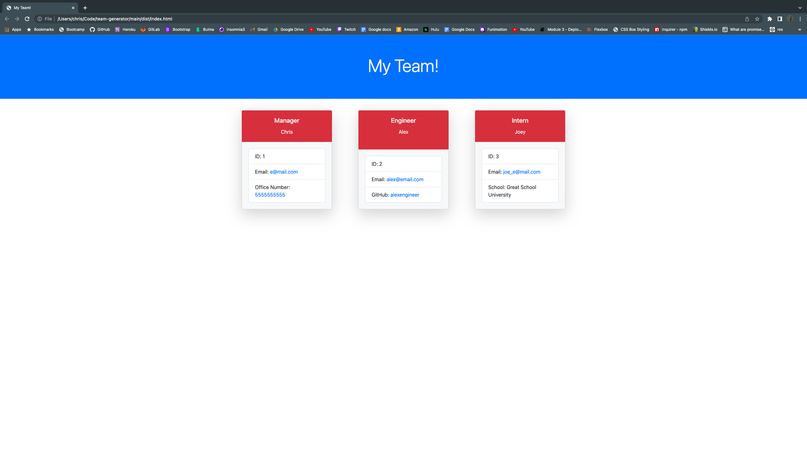

# Team Generator
  Created by Chris Cavazos
  
  # Description
  
  This project is all about teams. With this application, a user can run the inquirer prompts on their local CLI to add employees to their team, then an HTML page will be generated with a card for every team member!

  Each employee is generated through questions using the inquirer package in npm. Each employee can be given a role as Manager, Engineer or an Intern. Using classes, each employee is stored as an object.

  # Table of Contents
  
  * [Links](#links)

  * [Picture](#picture)

  * [Installation](#installation)
  
  * [Usage](#usage)
  
  * [License](#license)
  
  * [Technologies](#technologies)
  
  * [Tests](#tests)
  
  * [Questions](#questions)
  

# Links

<!-- [my-Portfolio Github URL](https://cavazosdotcom.github.io/team-generator) -->

[my-Portfolio Github Repo URL](https://github.com/cavazosdotcom/team-generator)

# Picture 



  # Installation

  To install necessary dependencies after cloning the repository, run the following command into this repo's terminal:
  
  ```bash
  npm i
  ```

  # Usage

  You must have `node.js` installed to run the application. Once installed run the command through your terminal:

  ```md
  node index.js
  ```

  # License

  This project does not have a license


  # Technologies

  - Node.js
  - NPM Inquirer
  - NPM Jest
  - NPM FS

  # Tests

  To run tests, run the command through your terminal:

  ```bash
  npm run test
  ```

  # Questions
  If you have any questions feel free to contact me at either [Github](https://github.com/cavazosdotcom), or [cavazosdotcom@gmail.com](cavazosdotcom@gmail.com)  

